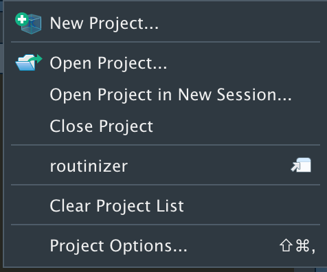

<!-- README.md is generated from README.Rmd. Please edit that file -->
<!-- badges: start -->

# routinizer 

<!-- badges: end -->

`routinizer` is a collection of functions that make data analysis chores
simple. For now, it has only one function, `routinize_proj`.
`routinize_proj` is not meant to be called explicitly by users, but it
will be used by [Rstudio](https://rstudio.com) when you create a new
project with the New Project Wizard.

## Installation

You can install `routinizer` from [Github
repo](https://github.com/jaylkim/routinzer).

``` r
remotes::install_github("jaylkim/routinizer")
```

Once you install the package, please restart
[Rstudio](https://rstudio.com) before using it.

## Usage

The first thing you might want to do before starting nalysis is create a
new project using the New Project Wizard.

<br>

<br>

If `routinizer` is installed, you can see the project template, **Data
Analysis Project Template**. Click it.

<br>

Then, you can see a dialog box.

<br>

Set the name of your project and its parent directory.

You can select options as follows:

-   Git: Initialize a local git repository.

-   Make: Create Makefile.

-   Docker: Create Dockerfile. The default image is
    [rocker/verse:latest](https://hub.docker.com/r/rocker/verse).

It creates folders as specified by the package.

-   data: Store any datasets, raw or processed.

-   doc: Documents, such as Rmd or pdf.

-   ext: Any external files, such as pptx or docx, that is not produced
    by your project.

-   src: Source code files.

-   output: Figures and tables produced by your project.

This structure is from
(<https://www.r-bloggers.com/2021/01/building-a-team-of-internal-r-packages/>).
This post is a great resource about managing collaborative data analysis
projects.


Everytime you open a project created by `routinizer`, it runs Makefile
and Dockerfile so that your project is up-to-date, if you have those.

Now enjoy your work!
